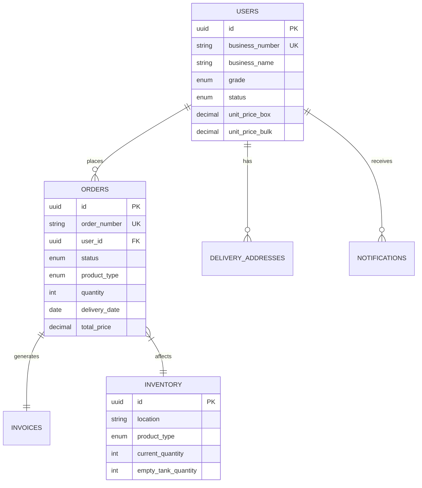

# 요소수 출고주문관리 시스템 아키텍처 문서

## 📋 프로젝트 개요

### 시스템 소개
요소수 판매 거래처(대리점/일반)를 위한 출고주문관리 하이브리드 앱 시스템입니다. Flutter 기반의 모바일 앱과 React 기반의 관리자 웹으로 구성됩니다.

### 핵심 기술 스택
- **Frontend**: Flutter 3.x + Riverpod + BLoC + GetWidget + VelocityX
- **Backend**: Supabase (PostgreSQL + Realtime + Auth + Storage)
- **DevOps**: GitHub Actions + Firebase App Distribution
- **External**: FCM, Email API, 사업자번호 검증 API

## 🏗️ 아키텍처 원칙

### Clean Architecture
본 프로젝트는 Robert C. Martin의 Clean Architecture 원칙을 따릅니다:

1. **독립성의 원칙**
   - 비즈니스 로직은 UI, 데이터베이스, 프레임워크로부터 독립적
   - 각 계층은 인터페이스를 통해서만 통신

2. **의존성 규칙**
   - 의존성은 외부에서 내부로만 향함
   - Domain Layer는 아무것도 의존하지 않음

3. **테스트 용이성**
   - 각 계층을 독립적으로 테스트 가능
   - Mock 객체를 통한 단위 테스트

### Feature-First 모듈화
기능 중심의 모듈 구조로 확장성과 유지보수성을 확보:

```
features/
├── auth/          # 인증 기능
├── order/         # 주문 관리
├── invoice/       # 거래명세서
├── inventory/     # 재고 관리
├── notification/  # 알림
└── admin/         # 관리자 기능
```

## 📁 프로젝트 구조

### 전체 구조도
```
def_order_app/
├── lib/                    # Flutter 앱 소스
├── web/                    # 관리자 웹 앱
├── supabase/              # Supabase 설정
├── architecture/          # 아키텍처 문서
└── test/                  # 테스트 코드
```

### 계층별 책임

#### 1. Presentation Layer
- **책임**: UI 렌더링, 사용자 입력 처리, 상태 관리
- **구성**: Pages, Widgets, Providers/BLoCs
- **기술**: Flutter, Riverpod, GetWidget, VelocityX

#### 2. Domain Layer
- **책임**: 비즈니스 로직, 유스케이스, 엔티티 정의
- **구성**: Entities, UseCases, Repository Interfaces
- **특징**: 순수 Dart 코드, 외부 의존성 없음

#### 3. Data Layer
- **책임**: 데이터 접근, API 통신, 캐싱
- **구성**: Models, DataSources, Repository Implementations
- **기술**: Supabase Client, Dio, SharedPreferences

## 🗄️ 데이터베이스 설계

### ER 다이어그램


### 주요 테이블
1. **profiles**: 사용자 정보 (Auth 확장)
2. **orders**: 주문 정보
3. **invoices**: 거래명세서
4. **inventory**: 재고 현황
5. **notifications**: 알림

### Row Level Security (RLS)
- 사용자는 자신의 데이터만 조회/수정 가능
- 관리자는 모든 데이터 접근 가능
- 단가 정보는 권한별 접근 제어

## 🔄 데이터 플로우

### 주문 생성 프로세스
```
1. UI (OrderCreatePage)
   ↓
2. State Management (OrderFormProvider)
   ↓
3. UseCase (CreateOrderUseCase)
   ↓
4. Repository Interface
   ↓
5. Repository Implementation
   ↓
6. Supabase Client
   ↓
7. Database Transaction
   - Order 생성
   - Inventory 차감
   - Notification 생성
   ↓
8. Realtime Update
   ↓
9. Push Notification (FCM)
```

### 실시간 업데이트
Supabase Realtime을 활용한 실시간 데이터 동기화:
- 주문 상태 변경 실시간 반영
- 재고 현황 실시간 업데이트
- 알림 실시간 전송

## 🔐 보안 설계

### 인증 및 권한
1. **사업자번호 기반 인증**
   - 사업자번호 진위 확인 API 연동
   - Supabase Auth 커스텀 클레임

2. **권한 관리**
   - 대리점: 전체 기능 접근
   - 일반 거래처: 제한된 기능 접근
   - 관리자: 시스템 전체 관리

### 데이터 보안
1. **단가 정보 보호**
   - 서버 사이드 계산
   - RLS 정책 적용
   - 클라이언트 최소 노출

2. **통신 보안**
   - HTTPS/WSS only
   - JWT 토큰 인증
   - API Rate Limiting

## 🎨 UI/UX 설계

### 디자인 원칙 (40-60대 사용자 중심)
1. **가독성**
   - 최소 16sp 폰트 사이즈
   - 높은 대비율 (WCAG AA 준수)
   - 명확한 레이블

2. **사용성**
   - 48dp 이상 터치 영역
   - 3단계 이내 태스크 완료
   - 직관적인 네비게이션

3. **피드백**
   - 명확한 상태 표시
   - 로딩 인디케이터
   - 에러 메시지 가이드

### GetWidget + VelocityX 활용
```dart
// 예시: 큰 버튼 컴포넌트
GFButton(
  onPressed: onPressed,
  text: "주문하기",
  size: GFSize.LARGE,
  fullWidthButton: true,
).p16().card.make()
```

## 📱 상태 관리 전략

### Riverpod + BLoC 하이브리드
1. **Riverpod 사용 케이스**
   - 전역 상태 (사용자 정보, 설정)
   - 간단한 UI 상태
   - 의존성 주입

2. **BLoC 사용 케이스**
   - 복잡한 비즈니스 로직
   - 폼 검증 및 제출
   - 다단계 프로세스

### 상태 관리 예시
```dart
// Riverpod Provider
final currentUserProvider = StateProvider<User?>((ref) => null);

// BLoC for Order Form
class OrderFormBloc extends Bloc<OrderFormEvent, OrderFormState> {
  // Complex form logic
}
```

## 🚀 배포 전략

### 환경 구성
- **Development**: 개발 및 테스트
- **Staging**: QA 및 사용자 테스트
- **Production**: 실제 운영

### CI/CD Pipeline
```yaml
# GitHub Actions
- Build & Test
- Code Quality Check
- Deploy to Firebase App Distribution
- Deploy to Stores (Production)
```

## 📊 모니터링 및 분석

### 성능 모니터링
- Firebase Performance Monitoring
- Supabase Dashboard
- Custom Metrics

### 에러 추적
- Firebase Crashlytics
- Sentry Integration
- Custom Error Logging

### 사용자 분석
- Firebase Analytics
- 커스텀 이벤트 추적
- 사용자 행동 분석

## 🔧 개발 가이드

### 코드 컨벤션
- [Effective Dart](https://dart.dev/guides/language/effective-dart) 준수
- Feature 단위 커밋
- 의미있는 커밋 메시지

### 테스트 전략
1. **Unit Tests**: 비즈니스 로직
2. **Widget Tests**: UI 컴포넌트
3. **Integration Tests**: E2E 시나리오
4. **Golden Tests**: UI 스냅샷

### 개발 환경 설정
```bash
# Flutter 설치
flutter channel stable
flutter upgrade

# 프로젝트 설정
flutter pub get
flutter pub run build_runner build

# Supabase 설정
supabase init
supabase start
```

## 📚 참고 자료

### 기술 문서
- [Flutter Documentation](https://flutter.dev/docs)
- [Supabase Documentation](https://supabase.io/docs)
- [Riverpod Documentation](https://riverpod.dev)
- [GetWidget Documentation](https://docs.getwidget.dev)

### 아키텍처 참고
- [Clean Architecture](https://blog.cleancoder.com/uncle-bob/2012/08/13/the-clean-architecture.html)
- [Flutter Clean Architecture](https://resocoder.com/flutter-clean-architecture-tdd/)
- [Feature-First vs Layer-First](https://codewithandrea.com/articles/flutter-project-structure/)

## 🤝 기여 가이드

### 브랜치 전략
- `main`: 프로덕션 배포
- `develop`: 개발 통합
- `feature/*`: 기능 개발
- `hotfix/*`: 긴급 수정

### 코드 리뷰 체크리스트
- [ ] Clean Architecture 원칙 준수
- [ ] 테스트 코드 작성
- [ ] 문서 업데이트
- [ ] 성능 영향 검토
- [ ] 보안 고려사항 확인

---

이 문서는 프로젝트의 전체적인 아키텍처를 설명합니다. 세부 구현 사항은 각 모듈의 README를 참고하세요.