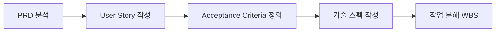
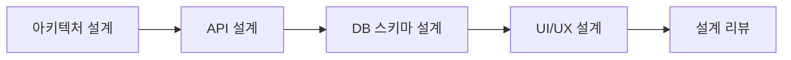
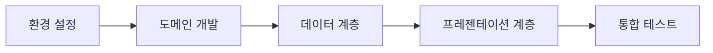

# 요소수 출고주문관리 앱 - 개발 워크플로우

## 📋 전체 개발 프로세스 개요

### 개발 방법론: Agile Scrum + Clean Architecture
- **스프린트 주기**: 2주
- **데일리 스탠드업**: 매일 오전 10시
- **아키텍처 패턴**: Clean Architecture + Feature-First
- **기술 스택**: Flutter + Supabase + Riverpod + GetWidget + VelocityX

## 🔄 개발 워크플로우

### 1. 요구사항 분석 단계


#### 체크리스트
- [ ] 비즈니스 요구사항 명확화
- [ ] 사용자 스토리 작성 (As a... I want... So that...)
- [ ] 수락 기준 정의 (Given... When... Then...)
- [ ] 기술적 제약사항 파악
- [ ] 작업 우선순위 설정

### 2. 설계 단계


#### 체크리스트
- [ ] Clean Architecture 계층 설계
- [ ] Feature 모듈 구조 정의
- [ ] API 인터페이스 설계
- [ ] Supabase 스키마 설계
- [ ] UI 와이어프레임 작성
- [ ] 기술 설계 문서 작성

### 3. 개발 단계


#### 개발 순서 (Clean Architecture)
1. **Domain Layer**
   - Entities 정의
   - Use Cases 구현
   - Repository Interfaces 정의

2. **Data Layer**
   - Models 구현
   - Data Sources (Supabase) 구현
   - Repository Implementations

3. **Presentation Layer**
   - Providers/BLoCs 구현
   - Pages/Screens 개발
   - Widgets 구현

### 4. 테스트 단계


#### 테스트 전략
- **단위 테스트**: 비즈니스 로직, Use Cases
- **위젯 테스트**: UI 컴포넌트
- **통합 테스트**: API 연동, 데이터 플로우
- **E2E 테스트**: 사용자 시나리오
- **성능 테스트**: 로드 타임, 메모리 사용

### 5. 배포 단계


## 🛠️ 기능별 개발 가이드

### 인증 기능 개발 워크플로우
```
1. 사업자번호 검증 API 연동
   - 외부 API 클라이언트 구현
   - 에러 핸들링 및 재시도 로직

2. Supabase Auth 설정
   - Custom Claims 설정 (user_grade, business_info)
   - RLS 정책 구현

3. 인증 플로우 구현
   - 회원가입 → 관리자 승인 대기 → 활성화
   - 로그인 → 토큰 관리 → 자동 갱신

4. UI 구현 (40-60대 사용자 고려)
   - 큰 입력 필드 (최소 48dp)
   - 명확한 레이블과 도움말
   - 단계별 진행 표시
```

### 주문 관리 개발 워크플로우
```
1. 주문 도메인 모델링
   - Order, OrderItem, Product 엔티티
   - 주문 상태 관리 (State Pattern)

2. 비즈니스 로직 구현
   - 재고 확인 UseCase
   - 가격 계산 UseCase (등급별 차등)
   - 주문 생성/수정 UseCase

3. Supabase 통합
   - 트랜잭션 처리 (주문 + 재고)
   - Realtime 구독 (상태 변경)

4. UI 구현
   - 제품 선택 (박스/벌크)
   - 수량 입력 (자바라, 반납통)
   - 배송 정보 입력
```

### 거래명세서 개발 워크플로우
```
1. PDF 생성 로직
   - 템플릿 설계
   - 동적 데이터 바인딩
   - 한글 폰트 처리

2. Storage 통합
   - Supabase Storage 업로드
   - Signed URL 생성
   - 캐싱 전략

3. 이메일 발송
   - 이메일 템플릿
   - 첨부파일 처리
   - 발송 상태 추적
```

## 📱 Flutter 특화 개발 가이드

### 상태 관리 패턴
```dart
// Riverpod Provider 구조
final authProvider = StateNotifierProvider<AuthNotifier, AuthState>((ref) {
  return AuthNotifier(ref.read(authRepositoryProvider));
});

// BLoC Pattern for Complex Forms
class OrderFormBloc extends Bloc<OrderFormEvent, OrderFormState> {
  // 복잡한 폼 로직 처리
}
```

### GetWidget + VelocityX 활용
```dart
// 40-60대 사용자를 위한 큰 버튼
GFButton(
  onPressed: onPressed,
  text: "주문하기",
  size: GFSize.LARGE,
  fullWidthButton: true,
)
.p16()
.card
.elevation(2)
.make()
```

### 오프라인 지원
```dart
// 로컬 캐싱 전략
class OfflineOrderRepository {
  Future<void> saveOrderLocally(Order order) async {
    // SharedPreferences or Drift DB
  }
  
  Future<void> syncPendingOrders() async {
    // 네트워크 복구 시 동기화
  }
}
```

## 🔍 코드 리뷰 체크리스트

### 아키텍처 준수
- [ ] Clean Architecture 계층 분리
- [ ] 의존성 규칙 준수
- [ ] Feature 모듈 독립성

### 코드 품질
- [ ] SOLID 원칙 준수
- [ ] DRY 원칙 적용
- [ ] 명확한 네이밍
- [ ] 적절한 주석

### 성능
- [ ] 불필요한 리빌드 방지
- [ ] 메모리 누수 체크
- [ ] 네트워크 호출 최적화

### 보안
- [ ] 민감 정보 노출 방지
- [ ] 입력 값 검증
- [ ] SQL Injection 방지

### 테스트
- [ ] 테스트 커버리지 > 80%
- [ ] Edge Case 처리
- [ ] 에러 시나리오 테스트

## 🚀 CI/CD 파이프라인

### GitHub Actions Workflow
```yaml
name: Flutter CI/CD

on:
  push:
    branches: [main, develop]
  pull_request:
    branches: [main]

jobs:
  test:
    runs-on: ubuntu-latest
    steps:
      - uses: actions/checkout@v2
      - uses: subosito/flutter-action@v2
      - run: flutter pub get
      - run: flutter analyze
      - run: flutter test --coverage
      
  build:
    needs: test
    runs-on: ubuntu-latest
    steps:
      - run: flutter build apk --release
      - run: flutter build ios --release --no-codesign
```

### 배포 프로세스
1. **개발 환경** → Feature Branch
2. **스테이징** → Develop Branch  
3. **프로덕션** → Main Branch

## 📊 품질 메트릭스

### 코드 품질 지표
- **테스트 커버리지**: > 80%
- **기술 부채 비율**: < 5%
- **순환 복잡도**: < 10
- **코드 중복률**: < 3%

### 성능 지표
- **앱 시작 시간**: < 2초
- **화면 전환**: < 300ms
- **API 응답**: < 1초
- **메모리 사용**: < 100MB

### 프로세스 지표
- **배포 빈도**: 주 2회
- **배포 성공률**: > 95%
- **평균 수정 시간**: < 4시간
- **코드 리뷰 시간**: < 24시간

## 🎯 성공을 위한 팁

### 개발 효율성
1. **페어 프로그래밍**: 복잡한 기능은 2명이 함께
2. **코드 리뷰**: 모든 PR은 리뷰 필수
3. **자동화**: 반복 작업은 스크립트로
4. **문서화**: 코드와 함께 문서 업데이트

### 팀 협업
1. **일일 스탠드업**: 15분 이내로 간결하게
2. **주간 회고**: 개선점 도출 및 실행
3. **지식 공유**: 기술 세미나 정기 개최
4. **투명한 소통**: 문제는 즉시 공유

### 품질 관리
1. **TDD 적용**: 테스트 먼저 작성
2. **지속적 리팩토링**: 기술 부채 최소화
3. **성능 모니터링**: 주기적인 성능 측정
4. **사용자 피드백**: 빠른 피드백 루프

## 🔧 문제 해결 가이드

### 일반적인 이슈와 해결책
1. **Supabase 연결 오류**
   - 네트워크 상태 확인
   - API 키 유효성 검증
   - RLS 정책 확인

2. **Flutter 플랫폼 이슈**
   - 플랫폼별 코드 분기
   - 네이티브 채널 활용
   - 커뮤니티 솔루션 검색

3. **성능 문제**
   - Flutter DevTools 프로파일링
   - 위젯 리빌드 최적화
   - 이미지/데이터 캐싱

4. **상태 관리 복잡도**
   - Provider 분리 및 조합
   - 명확한 상태 흐름 정의
   - 불필요한 상태 제거